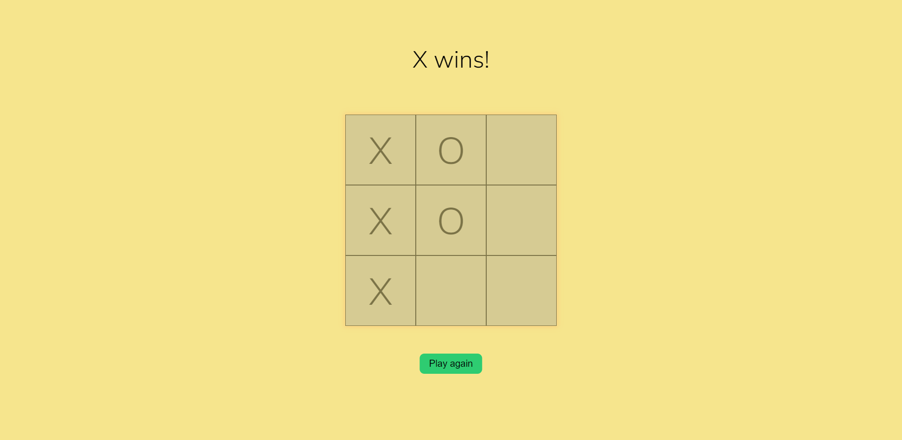
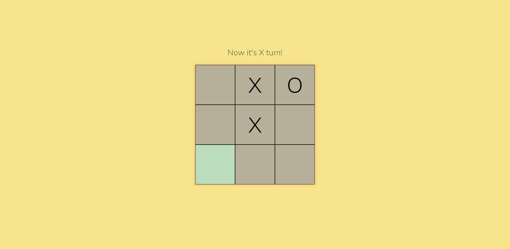
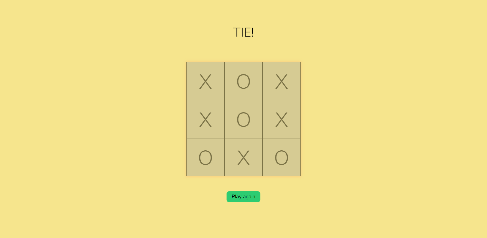

# Tic Tac Toe

## :mag: Overview

This is a project that allows you to play **tic tac toe**.

See the live version of my [website](https://kubaparol.github.io/tic-tac-toe/).

When one of the players wins the game or there is a tie, the board is locked and the corresponding message and button with the option to play again appears.

I used **pure CSS** and **JS**.

## :bulb: Technologies 


## :camera: Screenshots 




## :dizzy_face: Problems

The most trouble was to find out which player won. I created two arrays. One contained the indexes of winning combinations, while the other is assigned the players moves.

```
const winningCombinations = [
    [0, 1, 2], [3, 4, 5], [6, 7, 8],
    [0, 3, 6], [1, 4, 7], [2, 5, 8],
    [0, 4, 8], [2, 4, 6]
];

let playersMoves = [
    ['', '', ''],
    ['', '', ''],
    ['', '', '']
];
```

Then I created an object with two arrays X and O, to which the players moves are added. To array X the moves of player X and similarly to O.

```
    let moves = {
        'X': [],
        'O': []
    };
```

After each move, these boards are compared with the winning combinations.